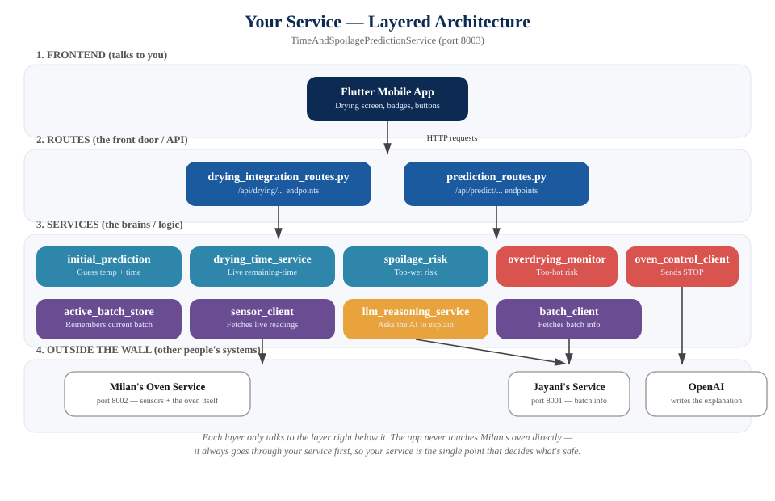
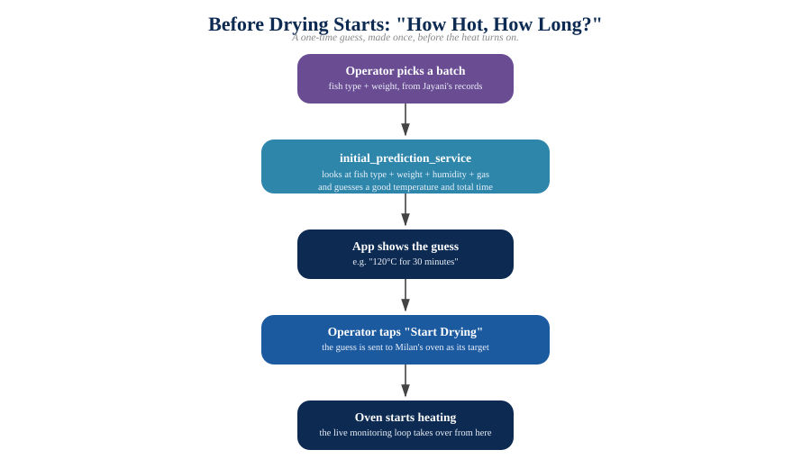
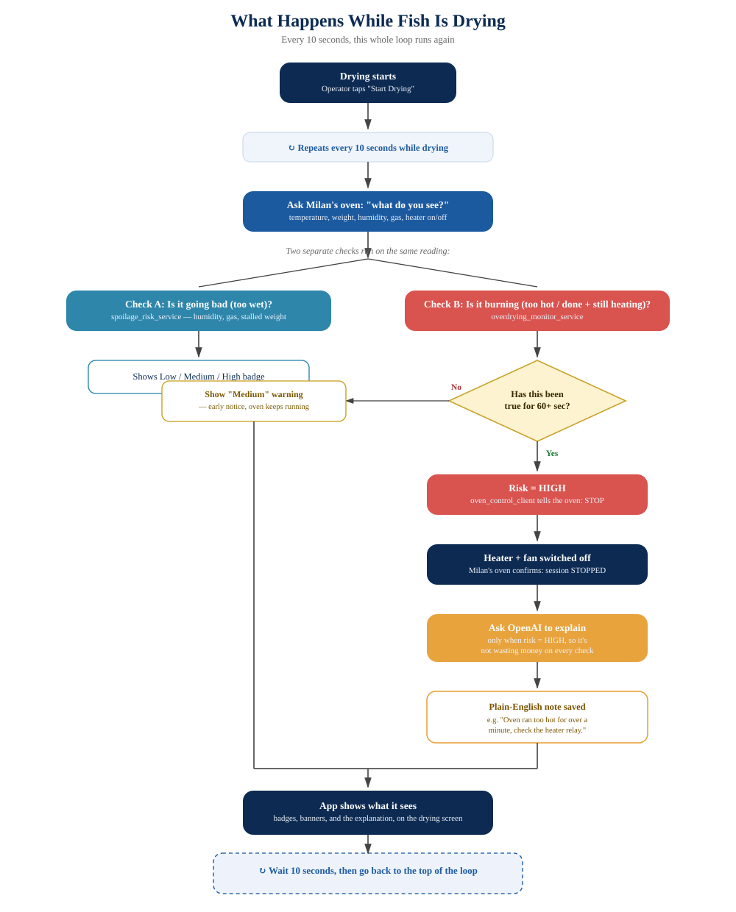

# My Part, Explained Simply

This document explains **your part** of the Smart Karawala project:
`TimeAndSpoilagePredictionService`. It answers two questions the oven
needs answered:

1. **Before drying starts:** how hot should the oven be, and how long
   will it take?
2. **While drying is happening:** how much longer, and is anything going
   wrong?

Read this like a story, top to bottom. Every picture referenced here is
a separate image file in this same folder.

---

## 1. The Big Picture (Layered Architecture)



Think of your service as a **building with floors**. Each floor only
talks to the floor directly below it — never skips a floor.

| Floor | What it is | In plain words |
|---|---|---|
| **1. Frontend** | The Flutter phone app | What the operator actually sees and taps |
| **2. Routes** | `drying_integration_routes.py`, `prediction_routes.py` | The **front door**. Every request from the app knocks here first. |
| **3. Services** | `overdrying_monitor_service.py`, `spoilage_risk_service.py`, and others | The **brains**. This is where the actual thinking/deciding happens. |
| **4. Outside the wall** | Milan's oven service, Jayani's batch service, OpenAI | Other people's systems you talk to over the internet (well — over your local network) |

**Why does this matter?** Because your app never touches the physical
oven directly. It always asks *your service* first, and your service
decides whether it's safe, then talks to Milan's oven on the app's
behalf. This means all the safety logic lives in **one place** — your
service — instead of being scattered across the app and the oven code.

### Who are the "outside" services?

- **Milan's oven service** (port 8002) — owns the actual hardware. It
  reads the sensors (temperature, weight, humidity, gas) and can turn
  the heater/fan on or off. You never touch the Arduino yourself — you
  ask Milan's service to do it.
- **Jayani's batch service** (port 8001) — keeps the list of fish
  batches (what kind of fish, how much it weighs, has it been salted
  yet).
- **OpenAI** — a company that runs an AI you can send a question to and
  get an answer back. You use it to turn numbers into a plain-English
  sentence.

---

## 2. Before Drying Starts: The First Guess



Before the oven even turns on, the operator picks a batch (which fish,
how much it weighs). Your service's job here:

1. Look at the fish type and weight (and a couple of live sensor
   readings, if available).
2. **Guess a good temperature and a total drying time.**
3. Show that guess to the operator.
4. When they tap "Start", that guess becomes the oven's actual target.

This guess comes from `initial_prediction_service.py`. It doesn't just
make up a number — it was **trained** ahead of time on a large table of
example fish-drying situations (weight, temperature, time), so it has
learned the general pattern of "heavier fish + lower temperature =
longer time" and so on. Two of those example situations are things we
actually measured with a real fish in a real oven — everything else in
that table was worked out using the physics of how heat dries food, so
the guesses stay realistic even for combinations nobody has tried yet.

**Key idea:** this is a **one-time guess**, made once, before any heat
turns on. It is not watching the oven live — that's a different job,
covered next.

---

## 3. While Drying Is Happening: The Live Loop



This is the important part. Once the oven starts, your service runs a
loop, **over and over, every 10 seconds**, for as long as the batch is
drying. Each time around the loop, it does the same four things:

### Step 1 — Ask the oven what it sees
Your service calls Milan's service and gets back the current
temperature, humidity, weight, gas reading, and whether the heater is
switched on.

### Step 2 — Run two separate checks on that one reading

These are **two completely different questions**, checked separately:

**Check A — "Is it going bad?" (`spoilage_risk_service.py`)**
This is about the fish staying **too wet for too long** — the classic
way dried fish spoils. It looks at:
- How humid the air is (damp air = bacteria-friendly)
- The gas sensor reading (a bad smell forming)
- Whether the weight has stopped dropping even after a long time (stalled
  drying)

It gives back **Low, Medium, or High** risk.

**Check B — "Is it burning / over-drying?" (`overdrying_monitor_service.py`)**
This is the *opposite* problem — the fish is **already dry enough, but
the oven is still cooking it**. This is a completely separate check from
Check A on purpose: "too wet" and "too hot" are opposite problems that
need opposite fixes, so mixing them into one score would hide which one
is actually happening.

It watches for two warning signs, and **either one is enough** to raise
concern:

  - **Sign 1 — "Done, but still heating."** The fish has already reached
    its target dry weight, but the heater is still switched on. Normally
    the oven should turn the heater off the moment the fish is dry — so
    seeing this means something is stuck or wrong.
  - **Sign 2 — "Too hot for too long."** The oven's temperature is
    sitting more than **10°C above** what the operator asked for.

  Either sign has to be true for **60 seconds in a row** before it counts
  as a real problem — one single noisy sensor reading is not enough to
  trigger anything. This stops a random glitch from causing a false
  alarm.

  > **Note about the gas sensor:** you might expect burning to be
  > detected by smell. It isn't. The gas sensor on this rig is built to
  > smell *spoilage* (rot), not *smoke*. So gas readings are only
  > mentioned as "by the way, gas is also high right now" — they never
  > by themselves cause a burn warning.

### Step 3 — Act on what was found

- If Check B stays true for under 60 seconds → show a **Medium**
  warning. The oven keeps running; this is just a heads-up.
- If Check B stays true for 60+ seconds → risk becomes **High**, and
  your service **tells Milan's oven to stop** — heater and fan both
  switch off. This is a real, physical safety action, not just a
  message on screen.

### Step 4 — Ask the AI to explain (only when it matters)

Only when risk reaches **High**, your service sends the numbers (what
the temperature was, what the target was, how long it had been like
that) to OpenAI and asks for a short, plain-English explanation. This
explanation gets saved and shown to the operator.

**Why only at High risk, and not every 10 seconds?** Two reasons:
1. Cost — asking the AI a question costs a small amount of money every
   time. If it asked on every single 10-second check, that adds up fast
   for no benefit.
2. It's pointless to explain something that isn't actually a problem
   yet.

There's also a rule that if the *same* problem is still going on, the
AI is only asked **once every 5 minutes** for it — not every 10 seconds
while the problem continues. One explanation is enough; you don't need
five almost-identical ones in a row.

### Step 5 — The app shows what it found

The badges, the warning banner, and the AI's explanation all appear on
the drying screen in the app, and the whole loop repeats.

---

## 4. How "How Much Longer?" Keeps Updating

There's a second, related question: once drying has started, *how much
longer will it take?* This uses a different piece, `drying_time_service.py`,
and it has its own small rule worth knowing:

- **Right after drying starts**, there isn't enough information yet to
  know how fast this particular batch is actually losing weight — you
  need to watch it for a little while first. So for roughly the first 3
  minutes (or until at least 3 grams have been lost), the app just shows
  the **original guess** from before drying started, counting down.
- **Once there's enough real data** (enough time has passed *and* the
  fish has actually lost some measurable weight), it switches over to a
  live re-estimate based on how fast the weight is actually dropping
  right now — which is usually more accurate than the original guess,
  because it's based on what's really happening, not a prediction made
  in advance.

This matters because if you check *too* early, "how fast is it losing
weight" doesn't mean anything yet — the number would be worthless or
even misleading (like dividing by almost nothing).

---

## 5. Where the ML Model Fits (and Where It Doesn't)

This is worth being precise about, because two different things are
happening in your part, and it's easy to mix them up:

| | Uses a trained ML model? | How it decides |
|---|---|---|
| "What temperature/time should we use?" (before drying) | **Yes** | A model trained ahead of time on example fish-drying situations |
| "How much longer, right now?" (during drying) | **Yes** | A model trained on example drying-progress situations |
| "Is it spoiling?" | **No** | Fixed rules on humidity/gas/stalled weight |
| "Is it over-drying / burning?" | **No** | Fixed rules on weight-vs-target and temperature-vs-target |
| "Explain what's happening in words" | **No model — it's OpenAI** | Not trained by you; it's a general-purpose AI you send a question to |

**Why doesn't the burn detector use a trained model?** Because training
a model needs real examples of fish actually burning, with sensor
readings attached, and nobody has collected any of those yet. A rule you
can read, explain, and adjust is the safer and more honest choice when
you don't have real failure examples to learn from — especially since
this rule is allowed to physically switch the oven off.

---

## 6. How to Validate Your Part (What to Actually Do)

"Validating" means proving each piece does what it's supposed to,
**before** you trust it or show it off. Here's a checklist, from
easiest to hardest.

### A. Check the service starts and the routes exist

```bash
cd Backend/src/TimeAndSpoilagePredictionService
python -m uvicorn app.main:app --host 0.0.0.0 --port 8003
```

Then open `http://127.0.0.1:8003/docs` in a browser — FastAPI
auto-generates a page listing every endpoint. If your new endpoints
(`/api/drying/active/overdrying-risk`, `/api/drying/active/reasoning`)
appear there, the wiring is correct.

### B. Test the "before drying" prediction on its own

Call the prediction endpoint directly with a few different fish
types/weights and sanity-check the numbers come back sensible (not
negative, not absurdly large, roughly matching what you'd expect for a
small piece of fish in an oven).

### C. Test the safety detector *without* touching the real oven

You don't need a fish or the Arduino to test the logic itself. Because
`overdrying_monitor_service.evaluate()` is a plain function, you can
call it directly with made-up sensor readings and check the result:

```python
from app.services import overdrying_monitor_service as m

# A batch that's already dry but the heater is still on
sensor = {
    "weight": 0.04, "temperature": 120.0, "gas": 100,
    "session": {
        "status": "DRYING", "completion_weight_kg": 0.05,
        "target_temperature_c": 120.0, "heater_commanded": True,
    },
}
result = m.evaluate("TEST-BATCH", sensor)
print(result["risk"])          # should say "Medium" the first time
print(result["should_stop"])   # should be False the first time
```

Check every case matters:
- A perfectly normal reading → should say **Low**.
- The "done but still heating" case, first seen → **Medium**, don't stop.
- The same case, after the 60-second window has passed → **High**, `should_stop: True`.
- The condition going away (weight rises back above target, or heater
  turns off) → should drop back to **Low** and reset the timer.
- Not currently drying (`status` isn't `"DRYING"`) → always **Low**, never
  stops anything.

### D. Test it live, end to end, safely

This is the real test — using the actual running services, but in a
**controlled, low-risk way**:

1. Start all three services (Milan's oven service, Jayani's batch
   service, your service).
2. Deliberately set the oven's target temperature very low (say, 20°C)
   compared to the room's actual temperature. This makes the "too hot"
   condition trigger quickly and safely — you're testing the *logic*,
   not actually burning anything.
3. Call your risk endpoint repeatedly (or just wait, since the app polls
   it automatically) and watch the risk level climb: Low → Medium →
   High.
4. Confirm the oven **actually stops** — check Milan's service directly,
   not just your own report of it, since you want independent proof it
   really happened, not just that your code *claims* it happened.
5. Confirm an explanation appears if you have set up an OpenAI key; if
   you have not, confirm the system still stops the oven correctly and
   simply skips the explanation — the safety action must never depend on
   the AI working.

### E. Confirm the AI failing doesn't break anything

This one matters a lot for a safety feature. Deliberately test it
**without** an API key configured, or with a wrong one, and confirm:
- The risk detection still works.
- The oven still stops when it should.
- The only difference is that no explanation text appears.

If removing the AI ever stops the oven from stopping, that is a serious
bug — the explanation must always be optional, never load-bearing.

### F. Check the cost-control rules actually work

Trigger a High-risk situation and call the risk endpoint several times
in a row within a short window. Confirm:
- Only **one** explanation gets generated (check
  `/api/drying/active/reasoning` — the list should not grow with every
  poll).
- Calling it again after risk drops back to Low and rises to High again
  produces a **new** explanation (the 5-minute window has to actually
  reset, not stay locked forever).

### G. Check what happens when things fail

- Turn off Milan's oven service and call your endpoints — you should
  get a clear error, not a silent freeze or a crash.
- Ask for the risk/prediction of a batch that isn't currently drying —
  you should get a sensible "no active batch" response, not an error
  page.

### H. What "done" looks like

You can call your part validated once:
- Every endpoint listed in the FastAPI docs page actually works when
  called.
- The safety logic behaves correctly in isolation (section C above),
  matching every case in that list.
- You've watched it work live at least once, end to end, with your own
  eyes on both your service's report *and* the oven's real status
  agreeing with each other.
- You've confirmed the AI being off doesn't break anything (section E).

---

## Quick Reference: Where Everything Lives

```
Backend/src/TimeAndSpoilagePredictionService/
├── app/
│   ├── config.py                          # all the settings (URLs, thresholds, the OpenAI key)
│   ├── routes/
│   │   ├── drying_integration_routes.py   # the "front door" for anything drying-related
│   │   └── prediction_routes.py           # the "front door" for standalone predictions
│   └── services/
│       ├── initial_prediction_service.py  # the "before drying" guess
│       ├── drying_time_service.py         # the "how much longer, live" re-estimate
│       ├── spoilage_risk_service.py       # "is it going bad" check
│       ├── overdrying_monitor_service.py  # "is it burning" check
│       ├── oven_control_client.py         # sends the actual STOP command
│       ├── llm_reasoning_service.py       # talks to OpenAI
│       ├── sensor_client.py               # fetches live readings from Milan's service
│       └── batch_client.py                # fetches batch info from Jayani's service
└── train_models/                          # the scripts that built the trained models
```
