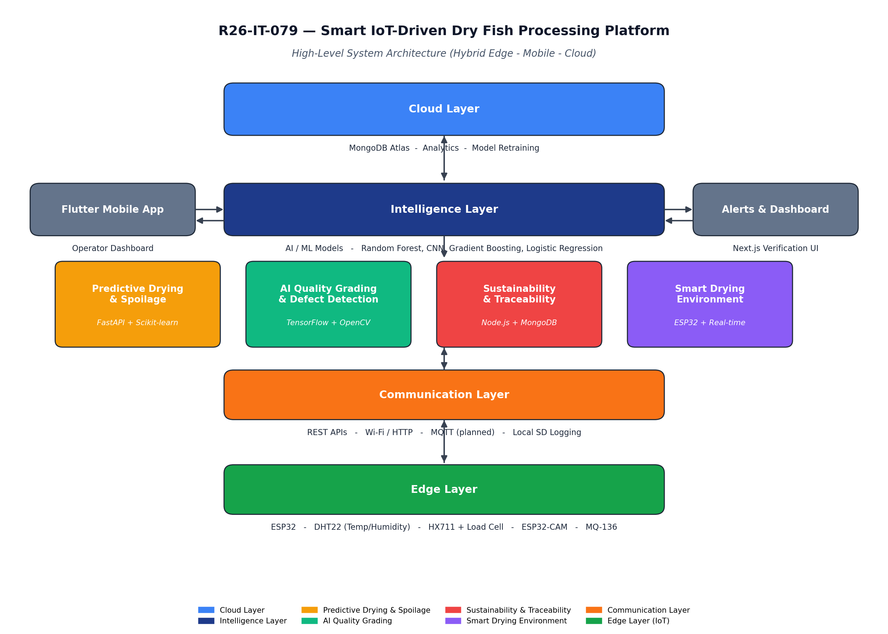

# R26-IT-079

## Smart IoT-Driven Platform for Sustainable Dry Fish Processing in Sri Lanka

An integrated AI–IoT research platform designed to modernize and digitize Sri Lanka’s traditional dry fish processing industry through intelligent monitoring, predictive analytics, computer vision, sustainability tracking, and digital traceability.

The platform combines machine learning, computer vision, IoT sensing, and real-time monitoring technologies to support small and medium-scale dry fish processors in improving product quality, reducing post-harvest losses, strengthening sustainability practices, and enabling data-driven decision-making throughout the drying workflow.

## 🌿 Git Conventions

To maintain a clean and organized codebase, all team members must follow the Git workflow below.

---

### Branch Naming

Use the following format:

```bash
<type>/<module>/<short-description>
```

#### Types

| Type | Purpose |
|------|---------|
| `feature` | New feature |
| `fix` | Bug fix |
| `refactor` | Code improvement |
| `docs` | Documentation updates |
| `chore` | Configuration/setup changes |

#### Modules

| Module | Description |
|--------|-------------|
| `backend` | Node.js backend |
| `mobile` | Flutter mobile app |
| `predictive` | ML prediction module |
| `vision` | Computer vision module |
| `traceability` | Sustainability & traceability |
| `iot` | Raspberry Pi & sensor integration |
| `dashboard` | Verification dashboard |
| `docs` | Documentation |

#### Examples

```
feature/backend/user-auth
feature/mobile/batch-dashboard
feature/predictive/spoilage-model
fix/vision/image-upload
docs/readme/update
```

### Commit Messages

We follow the Conventional Commits format:

```
<type>(<scope>): <description>
```

#### Examples

```
feature(backend): add batch API
feature(mobile): implement dashboard UI
fix(iot): correct humidity sensor reading
docs(readme): update installation guide
```

### Workflow

1. Create a branch from `dev`
2. Follow the naming convention
3. Commit with meaningful messages
4. Push your branch
5. Open a Pull Request to `dev`
6. Get at least one team review before merging
7. Only the project lead can merge `dev` into `main`

### Branch Strategy

- **`main`** → Protected production/stable branch
- **`dev`** → Main development branch for the team
- **Feature branches** → Created from `dev`

> Team members do not have direct access to the `main` branch to ensure project stability and protect the production codebase.

### Quick Workflow Example

```bash
git checkout dev
git pull origin dev
git checkout -b feature/mobile/dashboard-ui

git add .
git commit -m "feature(mobile): add dashboard UI"
git push origin feature/mobile/dashboard-ui
```

Then create a Pull Request to merge into `dev`.

### Important Rules

- Do not commit directly to `main`
- Always create feature branches from `dev`
- Pull latest changes from `dev` before starting work
- Keep commits clean and meaningful
- Use `.gitignore` properly
- Do not push `.env` or sensitive files

---

## Project Overview

Traditional dry fish processing in Sri Lanka still depends heavily on manual inspection, environmental guesswork, and experience-based decision-making. This often leads to:

- Inconsistent drying quality
- Spoilage due to humidity and weather changes
- Lack of quality assurance
- Poor waste management practices
- No proper digital traceability
- Financial losses for processors

This research introduces a smart digital ecosystem that integrates:

- Real-time IoT environmental monitoring
- Machine learning-based predictive analytics
- AI-powered computer vision grading
- Sustainability and waste tracking
- End-to-end digital traceability

The proposed system is designed specifically for Sri Lankan coastal processing environments and low-resource deployment settings.

## System Objectives

- Reduce post-harvest losses in dry fish processing
- Predict drying completion time and spoilage risk
- Detect contamination and grading defects using AI
- Improve sustainability and waste management practices
- Provide digital batch traceability and monitoring
- Support data-driven quality assurance
- Enable scalable and low-cost deployment for coastal processors

## High-Level System Architecture

The platform operates as a hybrid **edge – mobile – cloud** architecture.



The platform is organized as a modular AI–IoT system consisting of four interconnected research modules:

1. IoT Monitoring Module
2. Predictive Analytics Module
3. Computer Vision Quality Inspection Module
4. Sustainability & Traceability Module

The system integrates:

- ESP32-based IoT sensors
- Machine learning prediction services
- CNN-based image grading
- Flutter mobile applications
- Node.js backend services
- MongoDB database systems
- FastAPI inference APIs

## Core Research Modules

### 1. Predictive Drying & Spoilage Analytics

**Lead:** VIVIPEM L B R V (IT22639844)

This module uses IoT sensor time-series data to predict:

- Remaining drying completion time
- Spoilage risk levels (Low / Medium / High)

Key capabilities:

- Time-series feature engineering
- Drying completion prediction
- Spoilage risk classification
- Real-time risk alerts
- Dashboard integration
- Sensor-based environmental analysis

Technologies and algorithms:

- Random Forest
- Gradient Boosting
- Linear Regression
- Logistic Regression
- FastAPI
- Scikit-learn

### 2. AI-Based Quality Grading & Defect Detection

**Member 01:** Gunasekara D T C D P (IT22127396)

This module introduces AI-powered automated quality grading using computer vision and CNN-based image analysis.

Key capabilities:

- Automated dry fish quality grading
- Defect detection
- Mould contamination detection
- Insect contamination detection
- Live camera monitoring
- Verification station for human review
- Self-learning model improvement

Technologies:

- TensorFlow
- Keras
- OpenCV
- Python
- FastAPI
- Next.js
- Flutter

### 3. Sustainability & Traceability Module

**Member 02:** Peshala G A K J (IT22554536)

This module focuses on sustainable processing practices and digital traceability.

Key capabilities:

- Waste tracking and recording
- Digital batch history management
- Salt requirement prediction
- Sustainable waste handling support
- Waste recycling notifications
- Traceability timeline management

Features:

- Batch ID generation
- Waste event logging
- Batch traceability reports
- Sustainability dashboards
- Digital record management

### 4. Smart Drying Environment Monitoring

**Member 03:** Sanjaya E W M (IT22189394)

This module continuously monitors drying microclimate conditions using IoT sensors.

Key capabilities:

- Real-time temperature monitoring
- Humidity monitoring
- Unsafe condition alerts
- Threshold-based notifications
- Environmental trend analysis
- Live dashboard visualization

Hardware components:

- ESP32
- DHT22 Sensors
- Load Cells
- HX711 Modules

## Key Technical Features

### Real-Time IoT Monitoring

- Temperature monitoring
- Humidity tracking
- Weight monitoring
- Continuous sensor logging

### Machine Learning Predictions

- Drying completion estimation
- Spoilage risk prediction
- Salt requirement prediction
- Waste prediction models

### Computer Vision and AI

- CNN-based grading
- Defect classification
- Contamination detection
- Image verification workflows

### Mobile Dashboard

- Live batch monitoring
- Alert notifications
- Prediction visualization
- Traceability records

### Sustainability Tracking

- Waste event recording
- Recycling coordination
- Digital sustainability reports
- Traceability timelines

### Secure and Scalable Architecture

- REST APIs
- Role-based access control
- MongoDB data storage
- FastAPI microservices

## Technology Stack

### AI / Machine Learning

- Python
- Scikit-learn
- TensorFlow
- Keras
- OpenCV
- Pandas
- NumPy

### Backend

- Node.js
- Express.js
- FastAPI

### Frontend

- Flutter
- Next.js

### Database

- MongoDB

### IoT Hardware

- ESP32
- DHT22
- HX711 Load Cell
- ESP32-CAM

### Tools and Platforms

- GitHub
- Jupyter Notebook
- Google Colab

## System Workflow

1. IoT sensors collect environmental data continuously
2. Sensor data is transmitted to the backend server
3. Machine learning models analyze drying conditions
4. Computer vision models inspect dry fish quality
5. Prediction results are displayed on the dashboard
6. Alerts are sent for risky conditions
7. Traceability records are updated automatically
8. Sustainability events and waste logs are stored digitally

## Research Contributions

This research contributes to:

- Sustainable food processing
- Smart fisheries technology
- AI-driven quality assurance
- IoT-enabled environmental monitoring
- Digital traceability systems
- Waste reduction and circular economy practices

The system also supports several Sustainable Development Goals (SDGs):

- SDG 2 – Zero Hunger
- SDG 8 – Decent Work and Economic Growth
- SDG 12 – Responsible Consumption and Production
- SDG 14 – Life Below Water

## Research Team

| Member                | Role   | Module                                      |
| --------------------- | ------ | ------------------------------------------- |
| VIVIPEM L B R V       | Lead   | Predictive Drying & Spoilage Analytics      |
| Gunasekara D T C D P  | Member | AI-Based Quality Grading & Defect Detection |
| Peshala G A K J       | Member | Sustainability & Traceability              |
| Sanjaya E W M         | Member | Smart Drying Environment Monitoring         |

## Research Context

This project is developed as part of an undergraduate research initiative under the Department of Information Technology, Sri Lanka Institute of Information Technology (SLIIT).

The research focuses on applying Artificial Intelligence, Internet of Things (IoT), Machine Learning, and Computer Vision technologies to improve sustainability, quality assurance, and operational efficiency in Sri Lanka’s traditional dry fish processing industry.

## Installation & Deployment (High Level)

1. **IoT Units**

   - Flash ESP32 firmware for environmental and weight sensing
   - Calibrate DHT22 and HX711 load cells before deployment

2. **Backend Services**

   - Set up Python and Node.js environments
   - Run FastAPI and Express.js microservices
   - Connect to MongoDB for data persistence

3. **Mobile Application**

   - Install Flutter app on Android device
   - Connect to backend services via REST APIs

4. **Data Handling**

   - Sensor logs streamed from ESP32 to backend
   - Predictions, grading results, and traceability records stored in MongoDB
